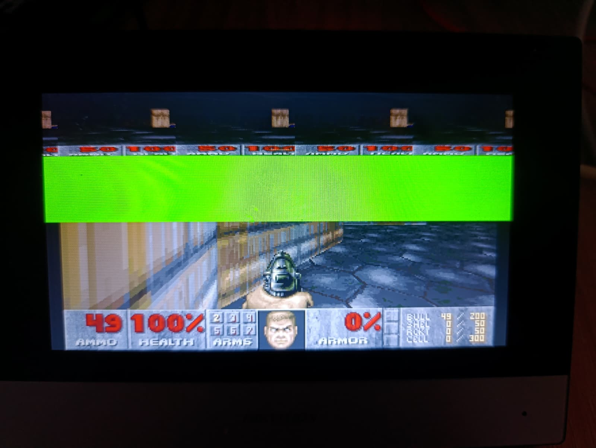
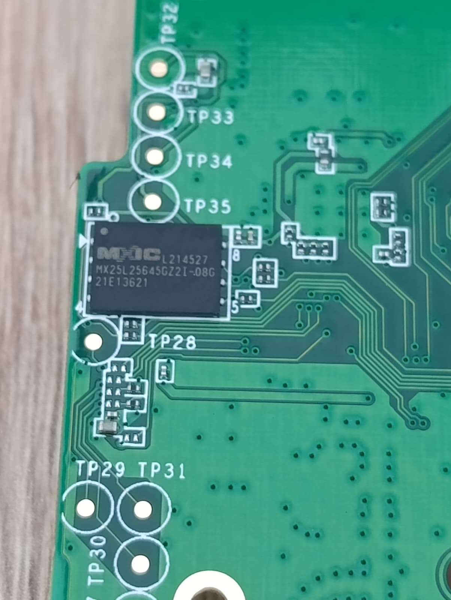
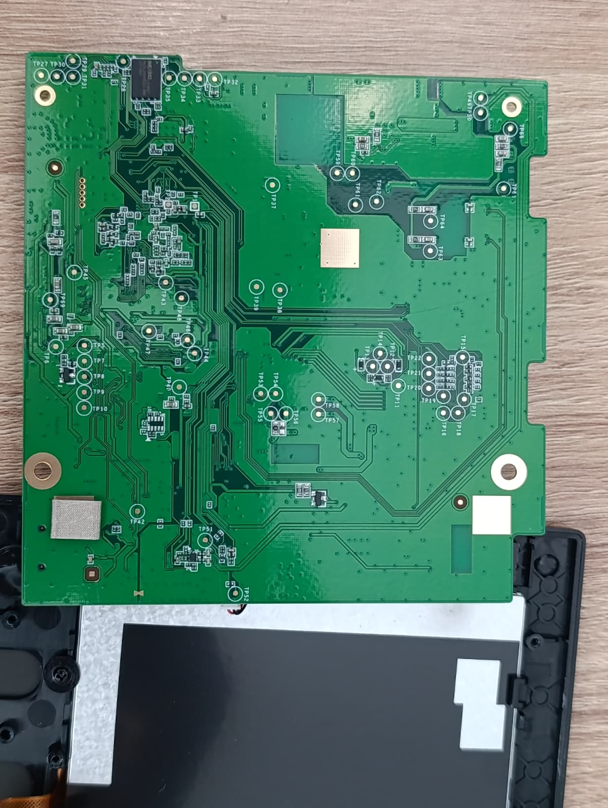
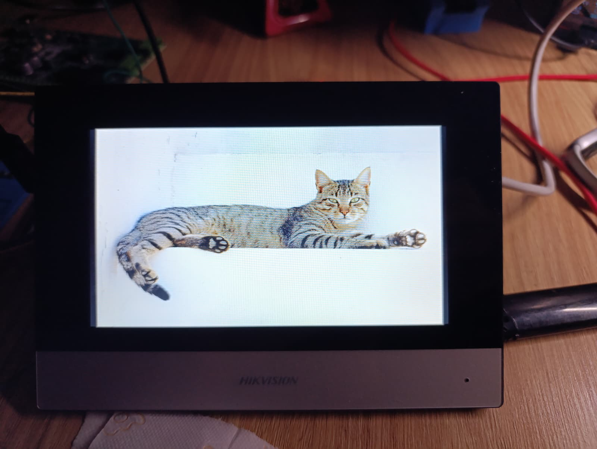
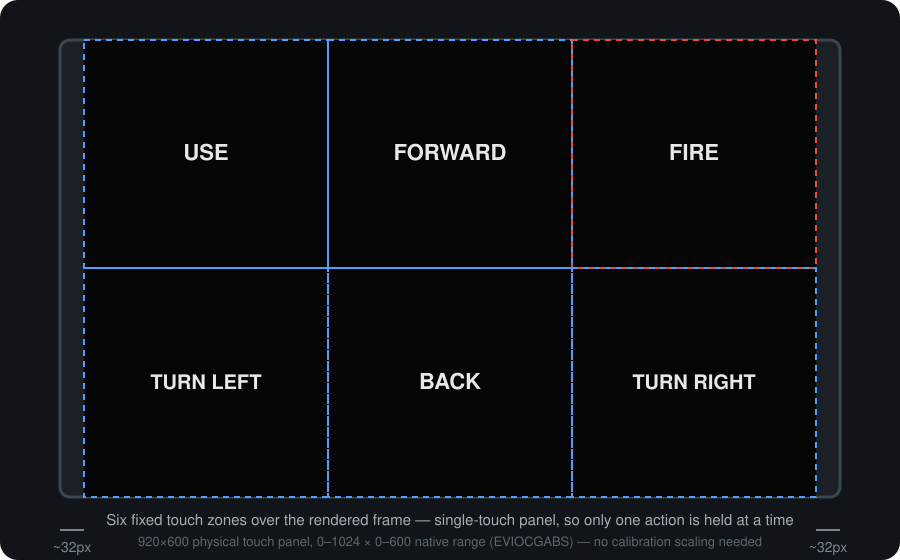
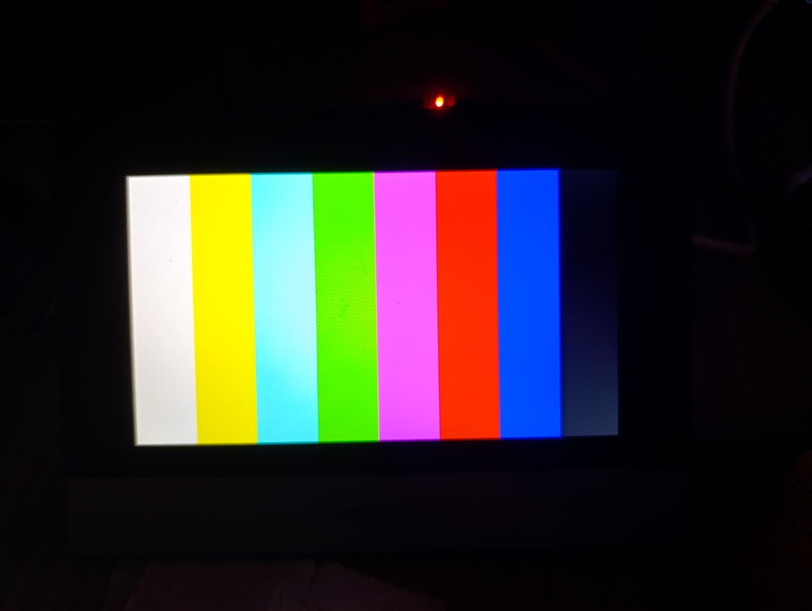
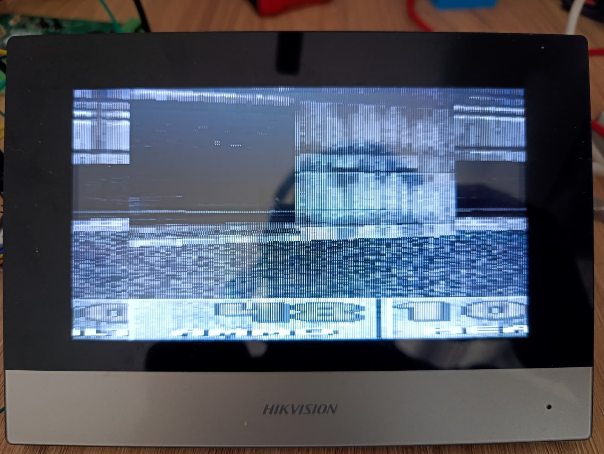
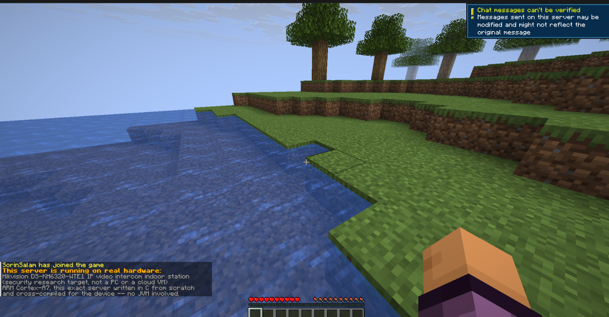
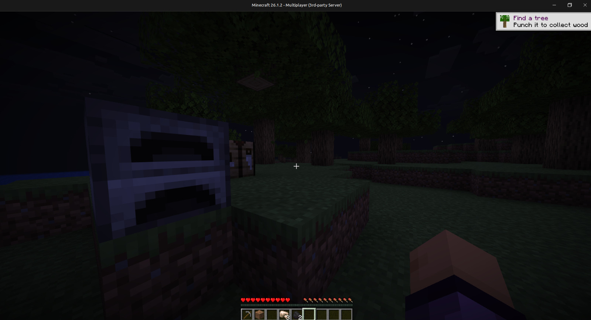

<link rel="shortcut icon" type="image/x-icon" href="icon.ico">
<link rel="stylesheet" href="https://cdn.jsdelivr.net/npm/swiper@12/swiper-bundle.min.css">
<link rel="stylesheet" href="./css/style.css">

<script src="https://cdn.jsdelivr.net/npm/swiper@12/swiper-bundle.min.js" defer></script>
<script src="./js/gallery.js" defer></script>

## It runs DOOM. It also runs Minecraft.



The **Hikvision DS-KH6320-WTE1** is a wall-mounted video intercom "indoor
station" — the panel inside the front door that shows you who's outside,
lets you buzz them in, and otherwise sits there running a locked-down
vendor GUI on a Linux system nobody's supposed to touch. It has a
1024×600 resistive-adjacent touchscreen, an ARM SoC, and — it turns out —
just enough headroom to run **DOOM** and a **Minecraft** server, once you
own the thing outright and get root.

This is the write-up of doing exactly that: chip-off flash extraction,
turning the vendor's restricted debug console into a real shell, and then
the actual engineering — finding where the framebuffer lives, teaching a
resistive touch panel to be a D-pad, and squeezing a Java-protocol
Minecraft server onto hardware that was never meant to run anything but
Hikvision's own GUI.

This sits alongside a broader security assessment of the same device,
kept and handled separately from this page — what's here is the "look what
root access gets you" side of the project, not the vulnerability research.

<div class="stats">
  <div class="stat"><span class="num">Rockchip RV1108</span><span class="lbl">SoC, single Cortex-A7 @ 1 GHz</span></div>
  <div class="stat"><span class="num">128 MB</span><span class="lbl">RAM, no swap</span></div>
  <div class="stat"><span class="num">1024×600</span><span class="lbl">Touch panel, single-touch</span></div>
  <div class="stat"><span class="num">32 MB</span><span class="lbl">SPI NOR flash, chip-off read</span></div>
  <div class="stat"><span class="num">8 GB</span><span class="lbl">microSD for persistent storage</span></div>
  <div class="stat"><span class="num">2</span><span class="lbl">Unsupported OSes now running</span></div>
</div>

---

## Getting a shell: chip-off, and turning `psh` into `sh`

Like most Hikvision embedded products, this device doesn't hand out a
console for free. The serial port on the board *does* drop you to a shell
prompt — but that shell is `psh`, a restricted vendor binary that gates
anything useful behind an RSA challenge-response only Hikvision itself can
answer. `/etc/profile` execs straight into it on every login, UART or
otherwise, so short of the private key, a stock unit's console is a dead
end.

Getting past that started at the flash chip, not the console.



*The device's entire persistent storage: one Macronix MX25L25645GZ2I-08G, 32 MB SPI NOR flash, sitting exposed on the board next to a dense grid of labelled test points.*

**1. Chip-off.** The device's entire persistent storage is a single
Macronix 32 MB SPI NOR flash IC, sitting exposed on the mainboard with no
epoxy potting. Desoldered and read directly with a flash programmer, it
gives a complete, bit-for-bit image of everything the device boots from —
bootloader, kernel, root filesystem, application binaries, the works.
That image is what makes everything downstream possible: it can be
studied, patched, and reflashed offline, with zero risk to a running unit
until a rewritten image is actually written back.

**2. Finding the actual boot path.** The root filesystem here is a
RAM-loaded initrd, rebuilt fresh from the flash image on every boot — and
critically, it's mounted **read-write** at runtime. A boot script runs
early in the init sequence, before the console shell ever spawns and
sources `/etc/profile`. That script is itself obfuscated on flash, using
an encryption scheme that turned out to lean on a single key baked
directly into a kernel module, recoverable by anyone willing to
disassemble it. Once that key's in hand, the boot script can be decrypted,
edited, and re-encrypted well enough to pass the device's own check on the
way in.

**3. The actual patch.** No binary got replaced — the fix is smaller than
that. One line, inserted near the top of the (re-encrypted) boot script,
strips the `/bin/psh` invocation out of the *in-memory copy* of
`/etc/profile` before the console shell ever reads it:

```sh
if [ -f /etc/profile ]; then
    awk '!/^\/bin\/psh/' /etc/profile > /tmp/.profile.nopsh \
      && cat /tmp/.profile.nopsh > /etc/profile
fi
```

Nothing on flash changes structurally — the ramdisk itself is untouched,
only this one boot script differs, and the edit above is redone in RAM on
every single boot. Since the root filesystem gets rebuilt from the
(unmodified) flash image every time anyway, this is about as close to a
reversible modification as an embedded device gets. Flash the original
image back and the device is exactly as it shipped.



*The same mainboard, back in the unit — panel connector, test-point grid, and the console header this whole console-access step runs over.*

<div class="win">
<strong>Result:</strong> power the board, attach a UART adapter to the
console header, and instead of a numeric RSA challenge you get a bare
<code>[root@dvrdvs] #</code> prompt. <code>id</code> reports
<code>uid=0(root)</code>. No login, no password, no vendor key required —
because the device is, at this point, unmistakably yours.
</div>

That console is also the delivery mechanism for everything that follows.
The device ships with its own `tftp` client, so cross-compiled binaries get
pushed over from a bench host and launched straight from the UART shell —
no network stack changes, no SSH daemon needed, just TFTP in and a shell
command to run it.

---

## Porting DOOM to a door-intercom touchscreen

The obvious first target, because it's the obvious first target for any
embedded Linux device with a framebuffer. The port used is
[doomgeneric](https://github.com/ozkl/doomgeneric)'s `linuxvt` backend —
pure framebuffer plus evdev, no X11, no SDL — cross-compiled statically
for ARM EABI5 with a Docker toolchain, since this device runs uClibc and
almost nothing built for a normal glibc host will run on it unmodified.

Getting a static binary onto the device turned out to be the easy part.
Getting a *picture* out of it was where the actual work was.

### Finding — and actually writing to — the framebuffer

The device exposes `/dev/fb0` like any other Linux framebuffer console,
and the first working build wrote to it exactly the way every framebuffer
tutorial says to: `mmap()` the device, `memcpy()` pixel data into it, done.
Every diagnostic said this was working — the process stayed alive at a
believable frame rate, and reading the mapped memory back showed real,
changing, DOOM-palette pixel data on every frame.

The panel stayed black.

<div class="bug">
<strong>The actual bug:</strong> on this SoC's framebuffer driver,
<code>mmap()</code> only updates the backing memory — it does <em>not</em>
by itself push anything to the display controller. A plain
<code>write()</code> to <code>/dev/fb0</code> does trigger a real update
(confirmed by writing raw noise to the device directly), but
<code>doomgeneric</code>, like most framebuffer software, only ever
<code>mmap()</code>s and <code>memcpy()</code>s. The fix is one ioctl call
— <code>FBIOPAN_DISPLAY</code> — issued once after the initial buffer setup
and again at the end of every drawn frame. That call is what actually
forces the panel to latch the new buffer; nothing about <em>what</em> gets
written needed to change, only the missing commit afterward.
</div>

With that one ioctl added, arbitrary pixel data started reaching the
physical panel for the first time — proven with the simplest possible
test before ever pointing DOOM at it: pushing an ordinary photo straight
into `/dev/fb0` and watching it actually appear on the glass.



*First real proof the panel was listening: a plain photo, pushed straight
into `/dev/fb0` after the `FBIOPAN_DISPLAY` fix, showing up correctly on
the actual glass.*

### Making the panel a controller

`doomgeneric`'s `linuxvt` backend only ever implemented *keyboard* input —
it has a stub concept of touch, but its actual device scanner looks for a
keyboard's key set and silently ignores anything that only reports
`EV_ABS` coordinates, which is all a touch panel ever sends. On a device
with no keyboard at all, that meant the build failed outright at startup
with "no compatible input device found."

Real touch support meant:

- **Detecting the touchscreen deliberately**, rather than assuming it —
  checking for the `EV_ABS` + `ABS_X`/`ABS_Y` + `BTN_TOUCH` combination
  evdev reports, and reading the panel's *own* declared coordinate range
  via `EVIOCGABS` instead of guessing it matches screen pixels. (It
  happens to: this panel reports `0–1024` × `0–600`, i.e. native pixel
  space, so no calibration scaling was actually needed here — but the code
  doesn't assume that.)
- **A fixed on-screen control scheme**, since the panel only reports a
  single point of contact at a time — no multi-touch. Six zones laid over
  the rendered frame stand in for a D-pad and two action buttons:



Moving a finger off one zone releases it, and entering a new one presses
that action — the same behaviour as a real d-pad, just drawn in software
rather than existing as a physical control. Confirmed working end-to-end,
not just at the event-detection level: dropped directly into a level with
`-warp 1 1`, tapping FORWARD visibly walks the player, and FIRE discharges
a weapon.

### The known bug: colours are off, and the picture is shifted

<div class="bug">
This one's real, understood, and not yet fixed. The screen is
single-buffered — there's only enough video RAM for one frame, not two —
and this SoC's <code>FBIO_WAITFORVSYNC</code> ioctl appears to be a stub
that reports success without actually blocking on real display timing.
The result is a classic tearing artifact: a frame can get committed
mid-scan, so a moving image shows a visible horizontal split, and static
content can appear shifted by a partial-frame offset. The colour palette
reads slightly muted for the same underlying reason — confirmed by writing
known-good static test patterns straight to the framebuffer (vivid,
perfectly accurate colours, zero shift) versus the same content going
through <code>doomgeneric</code>'s continuous per-frame commit loop (same
palette, visibly duller). The panel, the pixel format, and the colour path
are all confirmed correct in isolation; it's specifically <em>continuous,
unsynchronised writes</em> that produce the artifact.
</div>

The real fix is proper double buffering — render into an off-screen
buffer and pan to it only once a frame is complete — but that needs more
video RAM than this framebuffer currently has allocated, which is a
bigger change than a userspace program can make on its own. Filed as
future work rather than papered over.



*The control test referenced above: a plain colour-bar pattern, written
directly and once — no continuous per-frame commits. Vivid, accurate,
zero shift. This is what confirms the artifact belongs to
<code>doomgeneric</code>'s write pattern, not to the panel or the pixel
format.*

Getting here wasn't a straight line. An earlier attempt at fixing the
video path — re-latching the display mode on every frame — looked clean
in isolated testing and then produced this on the very next real run:



*An earlier, more aggressive fix attempt, mid-failure. Traced to a mode-set
ioctl that turned out to be non-deterministic on this hardware — it passed
clean tests twice before corrupting output the third time for no
input-side reason. Reverted outright rather than chased further; the
tearing bug above is the one that remains, not this one.*

<div class="note">
<strong>What does work cleanly:</strong> touch input, end to end. Movement,
turning, firing, menu navigation — all of it responds correctly and with no
detectable input lag, on real evdev events from the physical panel, not a
synthetic test harness. The rough edges here are entirely on the display
side.
</div>

---

## Then: a Minecraft server, on the same hardware

Once DOOM proved the toolchain and the deployment path both worked, the
natural next target was something with a very different resource profile:
a real, current-protocol **Minecraft Java Edition server**. Hand-rolling
a server from the wire protocol was tried first and abandoned early — not
because it's impossible, but because reimplementing a modern Minecraft
protocol from scratch on a device this constrained is a much bigger
undertaking than porting an existing one. The project switched to
[UCraft](https://github.com/vimpop/UCraft), an MIT-licensed Minecraft
server written in plain C specifically for resource-constrained machines,
cross-compiled with the same static ARM toolchain used for DOOM.



*The join banner says it plainly, because a screenshot alone wouldn't be
believable: "This server is running on real hardware: Hikvision
DS-KH6320-WTE1 IP video intercom indoor station... this exact server
written in C from scratch and cross-compiled for the device — no JVM
involved."*

**It works — a real client, connecting normally.** Point the official
Minecraft Launcher at the device's address on the matching protocol
version, and it shows up in the multiplayer list with a custom MOTD,
accepts the connection in offline mode, and spawns the player into a real,
non-flat world — hills, caves, ore veins, the works, generated by actual
3D Perlin noise rather than a flat superflat placeholder.



A few things mattered more than expected:

- **Protocol version has to match exactly.** Minecraft's wire protocol
  changes between even adjacent versions in ways that aren't always
  obvious from the outside — a client one version off gets partway through
  login before the connection dies on a decode error. The server config
  has to be pinned to precisely the protocol number the connecting client
  actually speaks.
- **The device's own single ARM core is the real constraint, not RAM.**
  With the vendor's own GUI process killed to free headroom, the server
  itself runs comfortably inside about 30 MB, but chunk generation —
  Perlin noise evaluated per-column — is CPU-bound work on a 1 GHz single
  core, and it's the first thing to show strain under load, not memory
  pressure.
- **Storage has to survive a reboot the root filesystem can't.** Because
  the root filesystem is rebuilt from flash on every boot, anything
  written to it — including a freshly placed server binary — evaporates
  the moment the device restarts. The fix is the same one every embedded
  Linux hack reaches for eventually: an inserted **8 GB microSD card**,
  mounted separately from the RAM-backed root filesystem, holds the
  server binary and world data persistently across reboots. The running
  *process* still has to be relaunched by hand after a restart — this
  device has no init mechanism left available to autostart it — but the
  data itself no longer disappears.

<div class="win">
<strong>Net result:</strong> the same door intercom that shows you who's
at the front gate, once, briefly, also ran a joinable Minecraft server off
a memory card taped to the inside of a wall-mounted panel — while the
device's own GUI kept working normally alongside it, since the server
touches nothing display-related.
</div>

---

## What's left

Both ports are functional, not finished. The known open items:

- **DOOM's tearing/colour-shift artifact** — needs real double buffering,
  which needs more framebuffer memory than is currently allocated to it.
- **No sound** — a real ALSA-based mixer was built and links cleanly, but
  the vendor GUI process holds the sound codec's one playback substream
  exclusively for as long as it's running.
- **No on-screen button graphics** for the DOOM touch zones — currently
  invisible, functional-only overlays.

None of it changes the headline: a locked-down commercial door intercom,
running a 30-year-old first-person shooter and a modern Java game server,
on hardware whose entire job description was supposed to be "show a video
feed and unlock a door."